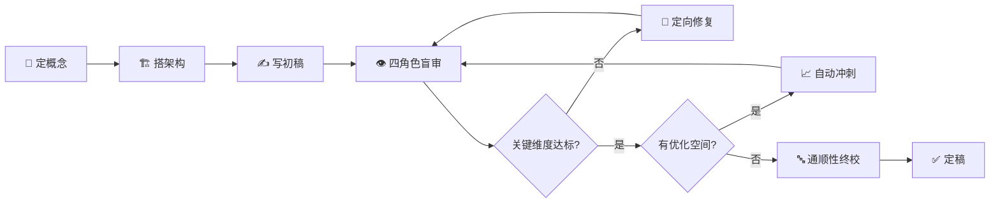

# 🔄 loop-short-story

<p align="center">
  
  
  
  
  
</p>

<p align="center">
  <b>你定概念 · AI 盲审打分 · 自动爬坡优化 · 输出可发表作品</b>
</p>

---

## 🤔 这是什么？

一个命令行工具。你定好故事概念和架构，系统生成初稿，**四个互不知晓的 AI 审稿人**各自从不同角度打分（因果逻辑、人物动能、文字质地……），系统算出总分后自动判断哪里弱、怎么修、修到什么程度停。修完还有"三审一裁一改"的文字终校流水线。

整个过程像一个不回头的打磨传送带——丢进去一篇稿子，滚出来一个可发表的终稿。

---

## 🔁 工作流程



| 流程图 | 实际含义 |
|---|---|
| 关键维度达标 | 总分 ≥ 40，且因果逻辑、信息递进、承诺兑现、文字自然度、收尾余味、开头转化 全部 ≥ 4 |
| 定向修复 | 系统自动路由到最弱的维度要求修改，最多 3 轮 |
| 有优化空间 | 安全路线可用且优化预算未耗尽，自动尝试冲更高分（目标 44） |
| 自动冲刺 | 改完重新盲审——不升反降则保留上一版最佳稿，最多 2 轮 |

---

## 👁️ 四角色盲审

四个审稿人互相不知道彼此的存在，各自只管自己的维度。这是系统的核心——不让人情或从众影响评分。

| 审稿人 | 管什么 | 问什么 |
|---|---|---|
| 🔗 **因果** | 故事逻辑 | 每件事有原因吗？递进顺畅吗？ |
| 🎯 **转化** | 开头+承诺 | 三秒知道读什么？读完觉得值？ |
| 🧑 **人物** | 能动性+情绪 | 主角在推故事还是被推？ |
| ✒️ **文字** | 语言+余味 | 句子舒服吗？三天后还记得吗？ |

---

## 📊 评分体系

满分 45（9 维 × 5 分）。但 **不是所有维度都一样重要**——系统把评分分成三层，避免审美分歧卡住一篇好稿子：

```
硬门 🚫    因果逻辑 · 信息递进 · 承诺兑现        → < 4 分直接不过
软门 ⚠️    文字自然度 · 收尾余味 · 开头转化      → 优先达标
主观 💭    题材差异化 · 主角能动性 · 情绪效果    → 仅提醒，不阻断
```

---

## 🧪 真实案例：《挂钟》

> 一篇 2776 字的心理悬疑短篇。从零到定稿，完整走完 v4 系统。

### 1. 定概念

作者写好 StorySpec——故事蓝图，声明主角、类型、冲突、目标情绪。系统验证通过后批准。

| 设定项 | 内容 |
|---|---|
| 主角 | 陈恕，32 岁，独立执业五年的心理医生 |
| 类型 | 心理悬疑 · 18-35 岁男性读者 |
| 核心冲突 | 在自己的诊疗记录中发现不记得写过的对话 → 追踪记忆篡改 → 发现诊断对象是自己 |
| 反转策略 | 先用临床方法论"赢了"，再用病历扉页颠覆——发现自己是病人 |
| 目标情绪 | 毛骨悚然——对"我是谁"产生根本怀疑 |
| 禁止项 | 不靠监控/手机/外来者告知，反转不引入新设定 |

### 2. 搭架构

StorySpec 批准后，拆成六场戏和若干叙事线——每条线有独立的起点、终点和闭合条件。系统验证因果闭环。

```
S1 诊室日常 → S2 发现异常 → S3 独立推导 → S4 系统验证 → S5 假性胜利 → S6 身份反转
```

### 3. 写初稿

系统根据架构生成初稿，2776 字。record-draft 通过（0 重复句子，结构完整）。

### 4. 四角色盲审

四个独立 Agent 同时读稿，每人只负责自己的维度——因果审稿甚至不知道预设结局。

| 维度 | 初评 | 审稿人原话 |
|---|---|---|
| 因果逻辑 | **5** | "双层因果：表面治疗师调查异常，深层病人妄想运行。" |
| 信息递进 | **5** | "六层递进，每层重新解释前一层。" |
| 题材差异化 | **4** | "临床方法论作为叙事引擎有差异。" |
| 开头转化 | **3** | "开头更多是氛围，临床操作可更早植入。" |
| 承诺兑现 | **5** | "三重揭露层层剥离，零解释收尾。" |
| 主角能动性 | **5** | "从秘密录音到坐进椅子——全由主角选择驱动。" |
| 情绪效果 | **5** | "毕业照→病历→不翻扉页→等响声。四层寒意。" |
| 文字自然度 | **3** | "碎片化风格自洽，但流畅度可提升。" |
| 收尾余味 | **4** | "环形结构挂钟首尾闭合。" |

**总分 39/45 · 13/13 读者测试全过。** 硬门（因果/递进/兑现）全部 5 分，但软门（开头转化=3、文字自然度=3）未达标 → `semantic_pass=false`，系统路由到 `promise` 要求修订开头。

### 5. 自动爬坡

| 轮次 | 发生了什么 | 分数变化 |
|---|---|---|
| R0 | 真盲审。oc=3, pn=3。 | 39 |
| R1 | 系统路由 `promise` → 要求修订开头。oc 从 3 恢复到 4，pn 仍为 3。 | 40 |
| R2 | 系统路由 `prose` → 要求修订文字。pn 从 3 恢复到 4。`semantic_pass=true`，全维度达标。 | 41 |
| R3 | 优化冲刺。同分再审，无提升空间，预算耗尽。系统保留 best_draft。 | 41 |

> oc=开头转化，pn=文字自然度。路由在 promise→prose→optimization 三个节点自动切换，无需人工干预。

### 6. 通顺性终校

三审（语法/逻辑/朗读）一裁一改 → 45/45 全 5 分 → `publication_ready`。

### 7. 定稿

`finalize` → complete。2776 字，3 轮修订。

<details>
<summary><span style="font-size:1.2em">📖 点击展开作品全文（2776 字）</span></summary>

---

# 挂钟

诊室的挂钟每一声都撞在同一个位置。陈恕听了五年，从实习生听到独立执业，从来没觉得这有什么不对——直到林远第三次来，他多按了一支录音笔。

不是因为林远说了什么特别的话。恰恰相反，林远的话都很朴素。二十五岁，银行柜员，主诉"觉得有人在编辑他的生活"。不是幻觉，不是迫害妄想，他不觉得有人要害他。他只是觉得细节在变：早晨放在门口的快递盒移到了消防栓旁边，手机备忘录里多出一条他没写过的购物清单，同事跟他提起一次聚餐他完全不记得参加过。

"你最近压力大吗？"陈恕问。

"不大。"林远想了想，"陈医生，你有没有想过——那个每星期坐在这把椅子上的，其实是你？"

椅子的方向是朝陈恕自己的。

不到一秒。陈恕在心里归档：反移情投射，治疗早期常见现象，不必解释，继续观察。

但他多按了一支录音笔。就诊桌上的主录音笔保持双份，抽屉里放第二支——这支他甚至没有录入设备清单。他自己也说不清为什么。也许因为林远说那句话的时候没有笑，也许因为那天的挂钟每一声都太准了，精准到像是有人在替他数。

当晚他从不安中醒来。凌晨三点十七分。窗外没有声音，挂钟在客厅。他试图回忆林远第三次的就诊内容——全部都在，清楚得像病例范本。于是他又睡了。

隔天整理诊疗记录，他发现了一段对话。

那段对话写在林远第三次就诊记录的第四段的第三行，夹在常规心理状态检查和家庭背景追问之间。林远描述了一段童年溺水经历——八岁，在乡下外婆家的水库，他记得水灌进肺里的声音，记得表哥把他拽上来之后他吐出来的水里有泥沙。这段对话占了一页纸的三分之一，措辞详尽。

陈恕一个字都不记得。

他调出录音。主录音笔，第四段，三分十二秒处——自己的声音："八岁溺水，你当时感觉到什么？"林远的声音描述水库，泥沙，表哥的手。整段对话一分四十秒。

第二支录音笔——空白。格式化过。

他坐在诊室的转椅上，挂钟响了七声。他翻出前两周的诊疗记录，反复看了三遍。每一段对话都认得，每一句提问都像自己说的话，顺序、措辞、诊疗逻辑全部自洽。只有那段溺水的记录，像一封别人塞进他文件夹里的信。

他没有惊动任何人。临床训练告诉他：记忆不是录像机，遗忘正常，填补正常，合理化正常。但遗忘不会删掉整段对话而保留前后每一个转场的细节——林远从"最近睡眠还好"过渡到溺水的那个提问，是他自己的声音。录音为证。他记得问"最近睡眠还好"，记得之后追问的家族史，唯独中间那段溺水，像有人用手术刀把它从他的记忆里完整地剜走了。

他在那段记录旁边画了一个小三角△，标注当时的情绪："胸口收紧。"

三天后，他重新翻开那份记录。△还在。但内容变了。

溺水变成了转学。林远九岁转学，换了三个同桌，第一个同桌偷过他的橡皮。陈恕的标注还在——"胸口收紧"——四个字贴在平淡如水的转学叙述旁边，像一个急诊室的标签挂在了体检报告上。情绪与内容不可调和。

他放下记录，从钱包里抽出父亲的老照片。照片放在钱包夹层里十年了，他几乎不看，但知道自己带着。父亲站在老家院门口，半侧身，嘴型似乎是在对他说话。

不对。父亲的嘴型，十年来看过几百次，应该是叫他的名字——嘴唇的动作他闭着眼都能画出来。但现在嘴型微微下撇，像在说另一个字。

他盯着那张照片看了很久。然后把照片翻到背面。十年前他在背面写了日期和地点。笔迹是他自己的，日期没变，地点没变。什么都没变——除了照片正面父亲嘴型的弧度。

他冷静地推导了两件事。

第一件事：诊疗记录的内容在变——不是因为记录本身有问题，而是因为记录指向了"某件事"，那件事在被删除。溺水是第一次，转学是第二次。他不知道有没有第三次。

第二件事：照片在变——但变的不是照片本身，而是"看照片的人不在照片里"。父亲嘴型的改变不是随机的，不是照片质量的退化。它明确、稳定、可验证。唯一的解释是：他在照片中的主观位置被移动了。他不再是照片里父亲正在叫的那个儿子，而只是一个旁观者。

这是陈恕第一次不需要林远的任何提示，纯靠自己的逻辑推导出一个结论。他把照片锁进办公桌最下面的抽屉，钥匙串在诊疗室钥匙旁边。

然后他开始建系统性的交叉比对方案。

三周数据。每次林远来诊前、后各做一次记忆标注测试：十组词对，自编量表，对比前后一致性。控制组用的是每周只见一次的督导案例——周三下午的王女士，分离焦虑，病程稳定。混淆变量逐个排除：睡眠时长、咖啡因摄入、情绪基线、天气。数据干净得让人不舒服。

结论：见林远后出现矛盾，不见时纹丝不动。相关性接近信号检测的硬阈值——p值小到他不想写下来。

唯一可控变量是终止治疗。但终止治疗意味着切断唯一的线索来源。他无法判断篡改是停止还是加速——他不在林远身边的时候，他的记忆还在被改吗？他不知道。他在赌。

最后一次治疗，林远坐在那把椅子上，比前几次都安静。

"你似乎不太想说话。"陈恕说。

"你每次都说最后一次。"林远看着他。

不到一秒。陈恕归档：反移情。治疗结构需要终止，患者的阻抗是正常反应。他完成收尾，写转诊建议，签名，起身。

门关上之后，挂钟响了很久。

连续七天，零异常。测试数据恢复基线，诊疗记录纹丝不动，照片锁在抽屉里没有再看。他赢了。

他用了五年独立执业，从来没在诊室挂过任何私人物品。他觉得专业空间应该保持中立。但那天他决定挂一张毕业照——迟到五年的仪式。

毕业纪念册翻到第八十六页。他先看到执业证书，塑封完好，签发日期清晰。上面的照片是他，名字也是他。他把纪念册翻回班级合影那页。

毕业照。他抽出来。三十个人，分成三排。他不认识任何一张脸。

不是"想不起来名字"——是每一个五官组合都没有触发任何识别反应。没有模糊的熟悉感，没有"这个人好像在哪见过"的迟疑。大脑面对这三十张脸，和面对三十个路人的面孔一模一样。

但身体记得。

那天的阳光照在后颈上的温度，学士服的领子摩擦锁骨，梧桐树的落叶卡在左边第三个人——那个他不认识的人——的鞋底。这些感知信号全部在线，像一段视频被删掉了所有人物而保留了全部环境音和体感。他的身体比他的记忆更诚实。

他放下相框。玻璃反射出挂钟的倒影。

他把林远的病历从档案柜里抽出来。完整的就医记录，封面是他的字迹，五年来他从头翻过无数次。但这次他翻开了扉页——诊断首页，入院基本信息。五年来他第一次翻这一页。

入院日期比他记忆中的早三年。

诊断：身份替代妄想。医生的签字栏里写着他自己的名字。"妄"字的第二笔永远比第一笔重，改不过来的习惯。他知道这是自己的字——不是仿的，不是伪造的。就是他写的。

他从来不翻扉页。入院就填好了，诊断、日期、签字，不需要反复看。五年来他翻病历翻了几百次，手从扉页上跳过几百次，从未迟疑。

他把病历合上，放在椅子的扶手上。

然后他坐进那把椅子——那把每星期看林远坐过几十次的椅子。从现在这个方向看，诊室的布局是另一个样子。挂钟不在背后，在正对面的墙上。

挂钟每一声都撞在同一个位置。

他没有总结。没有解释。他只是把病历放在扶手上，坐在那把椅子上，等挂钟的下一个响声。

</details>

---

## 📜 版本迭代

| 版本 | 行数 | 核心能力 |
|---|---|---|
| **v1** | 816 | 循环叙事专用 · 基础打分 |
| **v2** | 2420 | 多题材 · 四角色盲审 · 连续性台账 · 通顺性终校（三审一裁一改） |
| **v3** | 3730 | 🔥 双阶段自动爬坡 · 开放结局不再当 bug |
| **v4** | 4439 | 🎯 三层评分 · world_rules · mirror_character · 150+ 测试 |

> 📖 各 Loop 的设计原理和决策理由见 [Loop Engineering 说明](docs/loop-engineering.md)

---

## 🛠️ 快速开始

```bash
git clone https://github.com/Bowen-studying/loop-short-story.git
cd loop-short-story
python3 scripts/loop_project.py init my-story
```

完整工作流见 [SKILL.md](SKILL.md)。零依赖，纯 Python 标准库。

---

## 🎯 适合谁

- ✍️ 写短篇需要客观反馈的作者
- 🔧 有初稿想系统打磨到发表水准
- 📚 想理解"好故事为什么好"的写作学习者
- 🏫 短篇创作教学（审稿报告就是写作教材）
